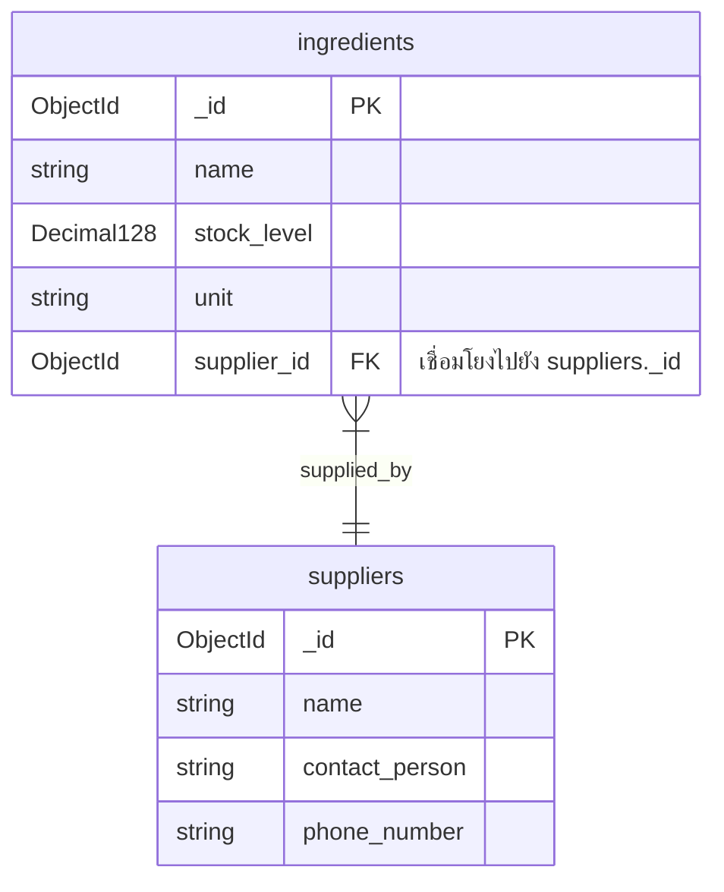
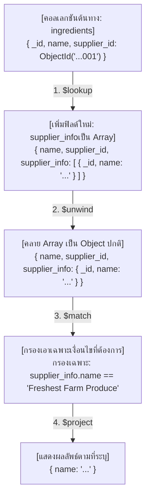

# สรุปขั้นตอนการทำ MongoDB Aggregation: Supplier Dependency Check (Task 4 Bonus)

เอกสารนี้สรุปแนวคิดการออกแบบคิวรี แผนผังความสัมพันธ์ และขั้นตอนการวิเคราะห์ข้อมูลผ่านสายพาน (Pipeline) สำหรับการหาวัตถุดิบที่ขึ้นตรงกับซัพพลายเออร์ที่กำหนด (Supplier Dependency Check)

---

## 1. เปรียบเทียบแนวคิด SQL vs MongoDB Aggregation

ในฐานข้อมูลเชิงสัมพันธ์ (Relational DB) เช่น PostgreSQL เราใช้การเชื่อมตารางด้วยคำสั่ง `JOIN` แต่ใน MongoDB (NoSQL) ซึ่งเก็บข้อมูลแยกคอลเลกชัน เราจะใช้การร้อยเรียงคำสั่งแบบสายพาน (Aggregation Pipeline) ดังนี้:

| ขั้นตอนการทำงาน | SQL Query | MongoDB Aggregation Stage |
| :--- | :--- | :--- |
| **จุดเริ่มต้น & ดึงข้อมูลหลัก** | `FROM ingredients` | `db.ingredients.aggregate([...])` |
| **การเชื่อมโยงข้อมูล** | `JOIN suppliers ON ingredients.supplier_id = suppliers.id` | `$lookup` (ดึงข้อมูลซัพพลายเออร์ที่ตรงกันเข้ามาใส่เป็น Array) |
| **คลายโครงสร้างผลลัพธ์** | *(ไม่ต้องทำเพราะ SQL คืนเป็นแถวแบนราบอยู่แล้ว)* | `$unwind` (เปลี่ยนจาก Array ของรายละเอียดซัพพลายเออร์ให้เป็น Object) |
| **การกรองข้อมูลเงื่อนไข** | `WHERE suppliers.name = 'Freshest Farm Produce'` | `$match` (กรองเอกสารโดยเทียบฟิลด์ซัพพลายเออร์ย่อย) |
| **การเลือกฟิลด์ที่จะแสดงผล** | `SELECT ingredients.name` | `$project` (ระบุ `{ _id: 0, name: 1 }` เพื่อดึงเฉพาะชื่อวัตถุดิบ) |

---

## 2. แผนผังความสัมพันธ์ของข้อมูล (Data Relationship Diagram)

ความสัมพันธ์ระหว่างคอลเลกชัน `ingredients` และ `suppliers` เป็นแบบ **Many-to-One (N:1)** โดยที่วัตถุดิบหลายตัวสามารถสั่งซื้อมาจากซัพพลายเออร์รายเดียวกันได้:



---

## 3. แผนผังขั้นตอนการไหลของข้อมูล (Pipeline Data Flow)

เมื่อรันคิวรี ข้อมูลเอกสารแต่ละใบในคอลเลกชัน `ingredients` จะไหลผ่าน Pipeline ดังนี้:



---

## 4. เจาะลึกการทำงานแต่ละ Stage ใน Pipeline

### 🔍 Stage 1: `$lookup` (การ Join ข้อมูล)
เนื่องจากเราต้องการดึงข้อมูลซัพพลายเออร์มาร่วมพิจารณาเงื่อนไข เราจึงต้องทำการเชื่อมคอลเลกชัน
* **`from: "suppliers"`**: บอกให้ MongoDB ไปค้นหาข้อมูลที่คอลเลกชัน `suppliers`
* **`localField: "supplier_id"`**: ใช้ฟิลด์อ้างอิงภายในตาราง `ingredients` ปัจจุบันเป็นตัวเทียบ
* **`foreignField: "_id"`**: ใช้คีย์หลักของตาราง `suppliers` ปัจจุบันเป็นเกณฑ์เทียบเพื่อดึงข้อมูลที่ตรงกัน
* **`as: "supplier_info"`**: นำผลการจับคู่ทั้งหมดมาเก็บลงในฟิลด์ใหม่ชื่อว่า `supplier_info` (มีรูปแบบเป็น Array)

### 🌀 Stage 2: `$unwind` (การแบนอาร์เรย์)
* โดยปกติ ผลลัพธ์จาก `$lookup` จะถูกส่งมาเป็น Array (เช่น `supplier_info: [ { ... } ]`) แม้ว่าจะมีข้อมูลตรงกันเพียงตัวเดียวก็ตาม
* การใช้ `$unwind: "$supplier_info"` จะช่วยถอดวงเล็บอาร์เรย์ออก เปลี่ยนให้โครงสร้างข้อมูลเป็น Object ชั้นเดียว (เช่น `supplier_info: { ... }`) เพื่อให้อ้างอิงและใช้งานง่ายขึ้นใน Stage ถัดไป

### 🎯 Stage 3: `$match` (การกรองข้อมูล)
* ใช้ค้นหาเอกสารที่มีค่าตามที่กำหนด
* เมื่อเราคลายข้อมูลแล้ว เราจะสามารถอ้างอิงชื่อซัพพลายเออร์ได้ตรง ๆ ผ่านเส้นทาง `"supplier_info.name"`
* กำหนดเงื่อนไขตัวกรองให้มีค่าตรงกับข้อความ `"Freshest Farm Produce"`

### 📋 Stage 4: `$project` (การกรองแสดงผลฟิลด์)
* หน้าตาของเอกสารดั้งเดิมมีทั้งไอดี จำนวนสต็อก และข้อมูลซัพพลายเออร์ที่ดึงมา
* โจทย์ระบุชัดเจนว่าต้องการส่งคืน **"เฉพาะชื่อของวัตถุดิบ (ingredient names)"**
* เราจึงตั้งค่าโปรเจกต์เป็น:
  * `_id: 0` (ปิดการแสดงผล ObjectId ของวัตถุดิบ)
  * `name: 1` (เปิดการแสดงผลชื่อของวัตถุดิบ)

---

## 5. ผลลัพธ์สุดท้ายที่คาดว่าจะได้รับ (Expected Output)

เมื่อรันคิวรีนี้ ผลลัพธ์ที่ได้จะเป็นรายการของวัตถุดิบทั้งหมดที่ส่งมาจากซัพพลายเออร์รายนี้ โดยแสดงผลเฉพาะชื่อวัตถุดิบ เช่น:

```json
[
  { "name": "Lettuce" },
  { "name": "Tomato" },
  { "name": "Special Sauce" },
  { "name": "Potatoes" },
  { "name": "Onions" }
]
```
